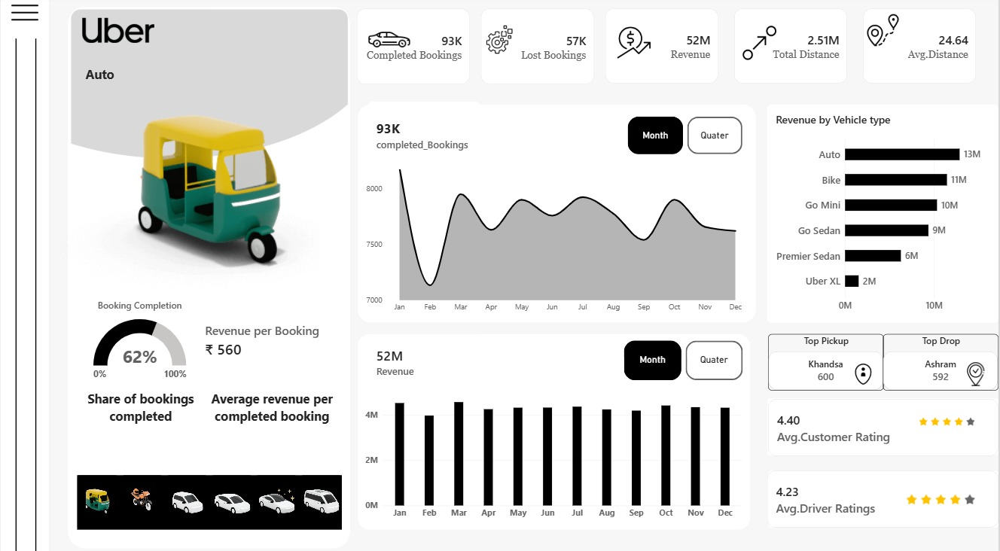
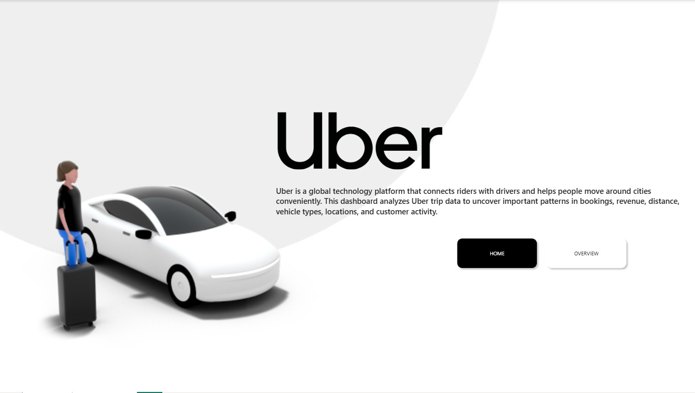

# 🚗 Uber Data Analytics Dashboard

An interactive **Power BI dashboard** designed to analyze Uber trip data and uncover insights into bookings, revenue, distance, vehicle performance, locations, and customer activity.

## 📊 Dashboard Preview

## 📌 Project Overview

The **Uber Data Analytics Dashboard** transforms Uber trip data into an interactive business intelligence dashboard.

The dashboard provides a clear view of:

* Booking performance
* Revenue trends
* Vehicle performance
* Trip distance
* Pickup and drop locations
* Customer ratings
* Driver ratings

The dashboard is designed to help users explore Uber trip performance and identify important business patterns.

## 🎯 Key KPIs

The dashboard tracks the following key performance indicators:

* **Completed Bookings**
* **Lost Bookings**
* **Total Revenue**
* **Total Distance**
* **Average Distance**
* **Booking Completion Rate**
* **Revenue per Booking**

## 📑 Dashboard Pages

This Power BI project contains **two pages**:

### 🏠 Home

The Home page provides an introduction to the Uber Data Analytics project and navigation to the main dashboard.

### 📊 Overview

The Overview page provides the main interactive analysis of Uber trips and business performance.

It includes:

* Bookings by month
* Revenue by month
* Revenue by vehicle type
* Top pickup locations
* Top drop locations
* Customer ratings
* Driver ratings
* Booking completion rate
* Revenue per booking

The vehicle selector allows users to explore performance across different vehicle types.

## 🛠️ Tools & Technologies

* **Power BI Desktop**
* **DAX**
* **Data Cleaning & Transformation**
* **Data Visualization**
* **Interactive Dashboard Design**

## 💡 Business Questions

This dashboard helps answer important business questions such as:

1. How many bookings were completed?
2. How many bookings were lost?
3. How much revenue was generated?
4. Which vehicle types generate the most revenue?
5. How do bookings change over time?
6. Which pickup locations are most popular?
7. Which drop locations are most popular?
8. What is the average distance traveled?
9. What is the booking completion rate?
10. What is the average revenue per completed booking?
11. How do customer and driver ratings compare?

## 📈 Key Analysis

The dashboard can be used to identify:

* Revenue contribution by vehicle type
* Monthly booking and revenue patterns
* High-demand pickup and drop locations
* Booking completion performance
* Average revenue per completed booking
* Customer and driver rating patterns

## 📂 Project Files

| File                       | Description                    |
| -------------------------- | ------------------------------ |
| `Uber Data Analytics.pbix` | Interactive Power BI dashboard |
| `Overview.jpeg`            | Overview dashboard screenshot  |
| `Home.jpeg`                | Home page screenshot           |
| `README.md`                | Project documentation          |

## 🚀 How to Use

1. Download the **`Uber Data Analytics.pbix`** file from this repository.
2. Open the file using **Power BI Desktop**.
3. Start from the **Home** page.
4. Navigate to the **Overview** page.
5. Use the vehicle selectors and interactive visuals to explore the data.

## 👨‍💻 Author

**Mohammed Sahil**

BTech CSE – Data Science

Interested in **Data Analytics, Power BI, SQL, Python and Data Science**.

---

⭐ If you found this project useful, consider giving the repository a star!
